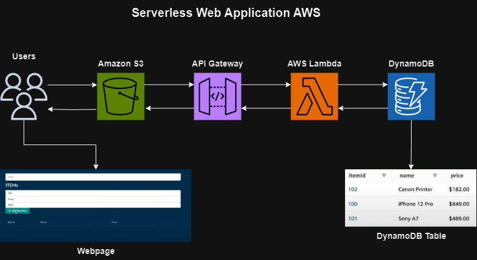

# Serverless Web Application README

Serverless Web Application on AWS 

Stack:
1. Amazon S3
2. API Gateway
3. AWS Lambda
4. DynamoDB
5. CloudFormation

This repository contains the code and instructions for deploying a serverless web application on AWS.

## CloudFormation Stack

1. Go to the AWS CloudFormation main page.
2. Create a new CloudFormation stack.
3. Upload the provided YAML template file.
4. Follow the wizard to create the stack.
5. Ensure the stack creation is successful.

## S3 Bucket Setup

1. Create an S3 bucket named `item-frontend-static-hosting` in your desired region.
2. Enable static website hosting on this bucket.
3. Set `index.html` as the index document.
4. Edit the bucket policy and CORS configuration as provided in the instructions.

## API Gateway Configuration

1. Navigate to the API Gateway section in the AWS Management Console.
2. Verify that the `items-api` has been created as part of the CloudFormation stack.
3. Copy the Invoke URL and note it down.
4. Follow the instructions to modify routes, integrations, stages, and CORS settings.
5. Deploy the API to the `prod` stage.

## Client-Side Code Setup

### Prerequisites

- Ensure Node.js version 18.x is installed on your local computer.

### Configuration

1. Update the frontend configuration file located at `client/src/config.ts` with the API's Invoke URL.
2. The API ID is the first part of the Invoke URL after `https://`.

### Building and Deployment

1. Open a command prompt and navigate to the `client` folder.
2. Install all dependencies by running `npm install`.
3. Build the production version by running `npm run build`.
4. Upload the contents of the `build` subfolder to the S3 bucket created earlier.
5. Ensure proper folder structure is maintained within the S3 bucket.
6. Access the frontend application by opening the `index.html` file at the root of the S3 bucket.

## Usage

The frontend application provides a dashboard page where users can:

- Add new items by specifying a unique ID, name, and price.
- View a grid of added items.
- Delete items.

## Additional Notes

- Ensure proper permissions and configurations are set up for security.
- Monitor the CloudFormation stack and API Gateway for any issues.